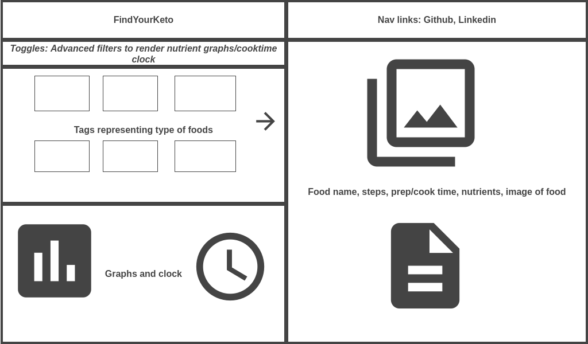

# JS Project Proposal: Find Your Keto

## Background:
Click [here](https://ishsgit.github.io/FindYourKetoRedux/)  is a tag driven website where each tag represents a core ingredient or quality behind a low carb recipe. There are many variations of tags a user may select from, the user can easily shuffle through a large variation of recipes, filter by tags in addition to filtering recipes by nutrients.

## Functionality & MVPs:

- Display the name, description, prep/cook time, steps, ingredients, servings, serving size, nutrients and an image
- A user may drag the tags, arrange, edit or delete them or drag and drop them on other tags to compile recipes with the collective tags.
- Each attribute of the recipe such as the description, steps/prep/cook time can be expanded upon click
- Click a toggle to display a more advanced menu allowing a user to control the number of calories, protein etc

#### In addition, this project will include:

- A nav link describing how to use the web page if need be
- Nav links to linkedin, and github
- A production readme

## Wireframes:

- Nav links to projects github, linkedin and help page detailing how to use the site
  On the left there are tags to click, drag around, drop over other tags to compile recipes
- Also on the left, a toggle to render the graphs and clock representing calories etc and prep/cook times. The toggle functionality is tentative but it is supposed to be clickable and shrink the tags section and render the graphs/clock, i will decide what to make default between rendering or render on toggle depending how far i get
- On the right side, data pulled with the respective tags will show. Ability to expand description, image, and steps are available

## Technologies, libraries, APIs:

- The D3.js for rendering bar graphs, and charts
- Webpack for stylesheets and script files

## Implementation Timeline: (Tentative)

- Thursday: Submit final proposal, setup project, review webpack and pull some data with API
- TBA
