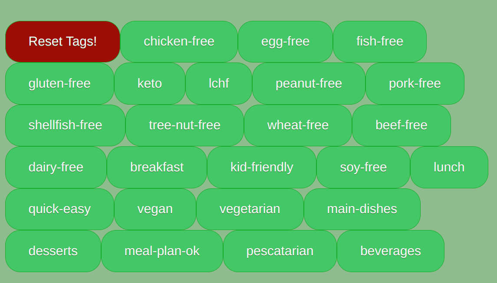

# JS Project Proposal: Find Your Keto

## Background:
[FindYourKeto](https://ishsgit.github.io/FindYourKetoRedux/)  is a tag driven website where each tag represents a core ingredient or quality behind a low carb recipe. There are many variations of tags a user may select from, the user can easily shuffle through a large variation of recipes, filter by tags in addition to filtering recipes by nutrients.

## Instructions:
Select from the tag buttons on the left hand. 

You can click one or more to show tiles displaying the name of a recipe described by the tag. Each tile shows the name and calories. Click the close button to return back to the tag selection. Tags that were selected already will be crossed out and cannot be chosen again. Click reset tags to start over. 


## Functionality & MVPs:

- Display the name, description, prep/cook time, steps, ingredients, servings, serving size, nutrients and an image
- A user may drag the tags, arrange, edit or delete them or drag and drop them on other tags to compile recipes with the collective tags.
- Each attribute of the recipe such as the description, steps/prep/cook time can be expanded upon click
- Click a toggle to display a more advanced menu allowing a user to control the number of calories, protein etc

## Wireframes:


- Nav links to projects github, linkedin and help page detailing how to use the site
  On the left there are tags to click, drag around, drop over other tags to compile recipes
- Also on the left, a toggle to render the graphs and clock representing calories etc and prep/cook times. The toggle functionality is tentative but it is supposed to be clickable and shrink the tags section and render the graphs/clock, i will decide what to make default between rendering or render on toggle depending how far i get
- On the right side, data pulled with the respective tags will show. Ability to expand description, image, and steps are available

## Technologies, libraries, APIs:

- The chart.js for rendering bar graphs, and charts
- Webpack for stylesheets and script files

## Implementation Timeline: 

- Thursday: Submit final proposal, setup project, review webpack and pull some data with API
- Tuesday: Rendering tags to display
- Wednesday: Rendering tags and tiles with graphs to page

## Technical implementation:
- Find Your Keto reads from a JSON file. Upon opening Find Your Keto, the userInput class instantiates and populates the display with the tags. The userINput class generates our tags as buttons by pulling from the JSON data and filtering for tags. The even listener is receives a click and goes to the event handler in the foodData class which pulls the recipe from the json data. The data is then rendered in recipeDisplay class.

```.js

import * as recipes from "../data/objects.json"

export default class recipeDisplay{
    constructor(){
        this.mContainer = document.getElementById("modal");
        this.modal = document.getElementById("modal-container");
        this.main = document.getElementById("main");
        this.rightContainer = document.getElementById("right-container");
        this.attribute = "";
        this.leftContainer = document.getElementById("left-container");
        this.container = document.getElementsByClassName("container");
    }

    generateCard(recipeNameArr){
        let alpha = ['a','b','c','d','e','f','g','h','i','j','k','l','m','n','o','p','q','r','s','t','u','v','w','x','y','z'];
       
        let cardName = "";
        recipeNameArr.forEach((name,idx)=>{
            cardName = document.createElement("button");
            cardName.className = "cardOne";
            cardName.classList.add(alpha[idx]);
            cardName.innerText = name;
            
            this.performActionBox(cardName, name)
            this.attribute = cardName.className;
            this.buttonInnerCard(cardName);
            this.rightContainer.appendChild(cardName);

            recipes.forEach((recipe)=>{
                if(recipe.name === name){
                var canvasElement = document.createElement("canvas");
           
                canvasElement.className = "mychart";
                canvasElement.style.position = "fixed";
                    
                canvasElement.style.display = "flex";
                let heavyColor = "rgba(255, 159, 64, 0.5)"
                let borderColor = "rgba(255, 159, 64, 1)";
                if(recipe.nutrients.caloriesKCal > 500){
                    heavyColor =  "rgba(255,221,238, 0.5)";
                    borderColor = "rgba(255,221,238, 1)";
                } else if(recipe.nutrients.caloriesKCal < 500 && recipe.nutrients.caloriesKCal > 300){
                    heavyColor = "rgba(255, 159, 64, 0.5)"
                    borderColor = "rgba(255, 159, 64, 1)";
                } else{
                    heavyColor = "rgba(221,255,221, 0.5)"
                    borderColor = "rgba(221,255,221, 1)";
                }
                var config = {
                  type: "bar",
                  data:{
                        labels: ["Calories"],
                        datasets: [
                            { 
                                label: "Calories:" + `${recipe.nutrients.caloriesKCal}`, 
                                data: [recipe.nutrients.caloriesKCal, 700],
                                backgroundColor: [
                                    heavyColor
                                ],
                                borderColor: [
                                    borderColor
                                ],
                                borderWidth: 1
                            }],
                      },
                };

                cardName.appendChild(canvasElement);
                
                var chart = new Chart(canvasElement, config);
            }
            });
              
        }); 
    }

    buttonInnerCard(cardName){
        const innerCard = document.createElement("button");
        innerCard.className = "popup";
        innerCard.innerText = "click for more details..."
        let name = cardName.innerText;
        cardName.appendChild(innerCard);
        this.performActionBox(innerCard, cardName, name);    
    }

    performActionBox(button, name){
        button.addEventListener("click", () => {
            const hasInfo = document.createElement("p");
            recipes.forEach((recipe)=>{
                
                if(recipe.name.includes(name)){
                    const nameText = document.createElement("p");
                    nameText.innerText = "Recipe Name: "+ name;
                    this.mContainer.appendChild(nameText);

                    const description = document.createElement("p");
                    description.innerText = "\n" + "Description: " + recipe.description;
                    this.mContainer.appendChild(description);

                    const prepTime = document.createElement("p");
                    prepTime.innerText = "\n" + "Preptime: " + recipe.prepareTime + " minutes";
                    this.mContainer.appendChild(prepTime);

                    const cookTime = document.createElement("p");
                    cookTime.innerText = "\n" + "Cooktime: " + recipe.cookTime + " minutes";
                    this.mContainer.appendChild(cookTime);
                        
                    const ingredients = document.createElement("p");
                    ingredients.innerText += "\n" + "Ingredients: ";
                    recipe.ingredients.forEach((ingredient)=>{
                        const ingName = document.createElement("ul");
                        ingName.innerText = ingredient.name;
                        ingredients.appendChild(ingName);
            
                        this.mContainer.appendChild(ingredients);
                    });

                    const stepPTag = document.createElement("p");
                    stepPTag.innerText = "\n" + "Steps: ";
                    const stepText = document.createElement("p");
                    stepText.innerText = recipe.steps;
                    stepPTag.appendChild(stepText);
                    this.mContainer.appendChild(stepPTag);

                    
                }
            })
            
            this.modal.style.display = "block";
            const close = document.createElement("button");
            close.className = "closeBoxPopUp";
            this.mContainer.appendChild(hasInfo);
            this.performCloseAction(this.modal);
          
          });
    }

    performCloseAction(button){
        button.addEventListener("click", () => {
           this.resetModal();
           this.modal.style.display = "none";
        });
    }
    
    resetModal(){
        while (this.mContainer.firstChild) this.mContainer.removeChild(this.mContainer.firstChild);
      }
}
```

## Future Updates:
- Update styling on body, header, tags and tiles
- Render graphs representing essential nurtritional values in tiles
- Render graphs and charts representing nutritional values in tile pop up
- Makes tiles drag and drop
